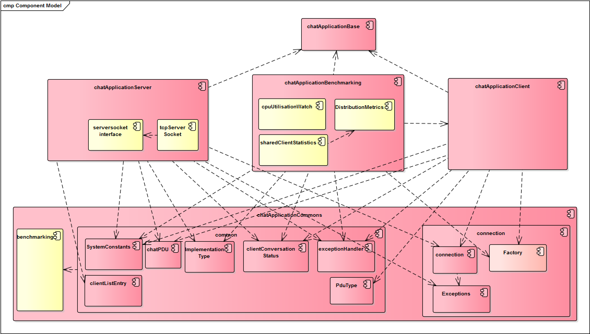

# chatapplication

## Architektur IST-Stand

## Quellen zum Nachschlagen
 - JMS Beispiel (funktioniert) https://github.com/deege/deegeU-jms-001
 - JMS Tutorial implementierung http://www.mastertheboss.com/jboss-server/jboss-jms/jms-20-tutorial-on-wildfly-as
 
 - Wildfly Messaging configuration https://docs.jboss.org/author/display/WFLY8/Messaging+configuration
 - Wildfly 8 Getting Started https://docs.jboss.org/author/display/WFLY8/Getting+Started+Guide
 
 
 - Prof. Mandl's website https://www.wirtschaftsinformatik-muenchen.de/?page_id=588
 