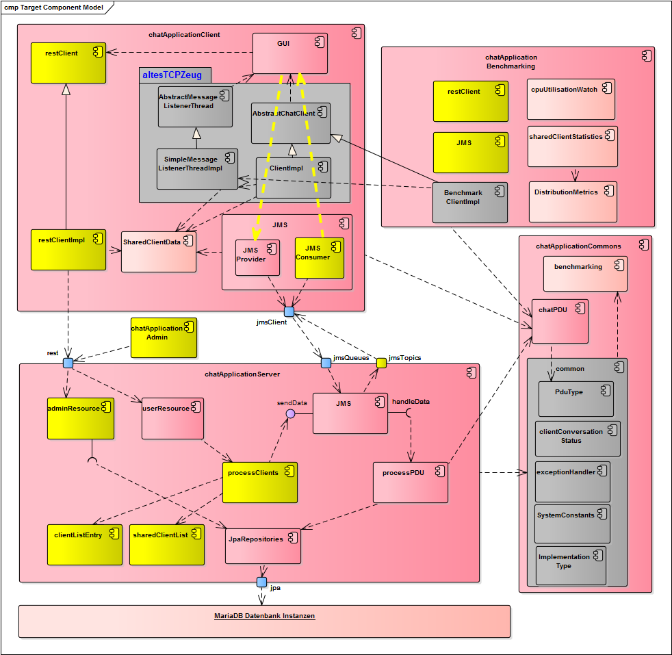
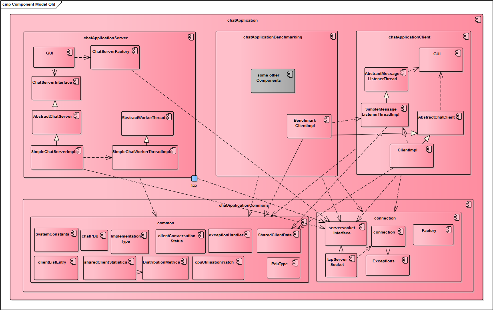

# Chatapplication Jboss 7.1 / Wildfly 10

## Getting started
    1. Wildfly 10 herunterladen
    2. standalone.xml durch standalone-full.xml ersetzen oder Wildfly mit der -full.xml starten.
    3. Maven-build auf dem Parent-Projekt ausführen (mvn clean install)
    -> Die Serverkomponente wird automatisch auf dem Wildfly deployed
    3. MariaDB aufsetzen
    -> localhost:3316 - Datenbanken: tracedb und countdb - Credentials: root 50Ananas!

## Architektur IST-Stand

## Architektur Stand zum Anfang

## Quellen zum Nachschlagen
 - JMS Beispiel (funktioniert) https://github.com/deege/deegeU-jms-001
 - JMS Tutorial implementierung http://www.mastertheboss.com/jboss-server/jboss-jms/jms-20-tutorial-on-wildfly-as
 
 - Wildfly Messaging configuration https://docs.jboss.org/author/display/WFLY8/Messaging+configuration
 - Wildfly 8 Getting Started https://docs.jboss.org/author/display/WFLY8/Getting+Started+Guide
 
 
 - Prof. Mandl's website https://www.wirtschaftsinformatik-muenchen.de/?page_id=588
 